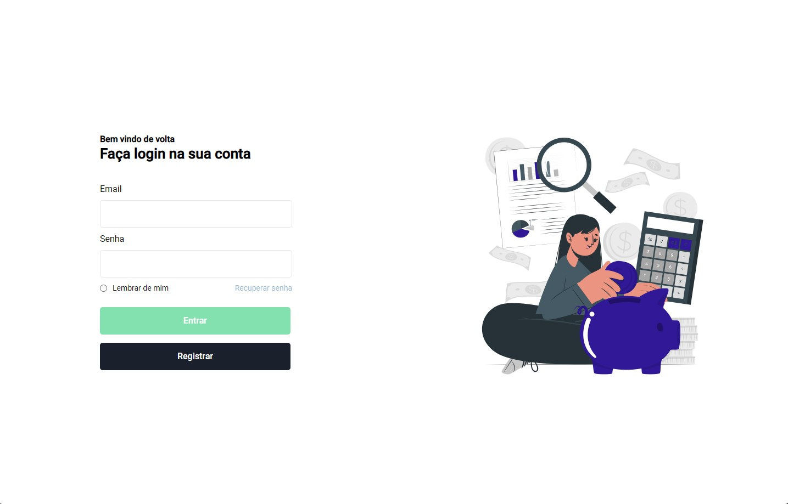

# CRUD - Controle de gastos

> Projeto criado com o intuito de aplicar meus conhecimentos nas tecnologias HTML, CSS e JS, além de também contrair novos conhecimentos de tecnologias como Firebase, Express, API Rest entre outras.

### Ajustes e melhorias

O projeto ainda está em desenvolvimento e as próximas atualizações serão voltadas nas seguintes tarefas:

- [x] Tela do dashboard (Desktop)
- [x] Consulta de dados com JS
- [x] Queries e Índices do banco de dados
- [ ] Validação do formulário de transação
- [ ] Salvar transação no banco de dados
- [ ] Atualizar documento do firestore com JS
- [ ] Camada de serviço para acessar o backend

## 📫 Contribuindo para o projeto.

Para contribuir com o projeto, siga estas etapas:

1. Bifurque este repositório.
2. Crie um branch: `git checkout -b <nome_branch>`.
3. Faça suas alterações e confirme-as: `git commit -m '<mensagem_commit>'`
4. Envie para o branch original: `git push origin <nome_do_projeto> / <local>`
5. Crie a solicitação de pull.

Como alternativa, consulte a documentação do GitHub em [como criar uma solicitação pull](https://help.github.com/en/github/collaborating-with-issues-and-pull-requests/creating-a-pull-request).

## 🤝 Colaboradores

Agradecemos às seguintes pessoas que contribuíram para este projeto:

<table>
  <tr>
    <td align="center">
      <a href="#">
         
        
          <b>Pedro Augusto</b>
        
      </a>
    </td>
  </tr>
</table>

## 😄 Seja um dos contribuidores 

Quer fazer parte desse projeto? Clique [AQUI](CONTRIBUTING.md) e leia como contribuir.

## 📝 Licença

Esse projeto está sob licença. Veja o arquivo [LICENÇA](LICENSE.md) para mais detalhes.

[⬆ Voltar ao topo](#nome-do-projeto) 
Footer
© 2022 GitHub, Inc.
Footer navigation
Terms
Privacy
Security
Status
Docs
Contact GitHub